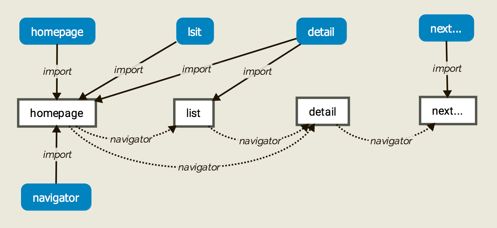
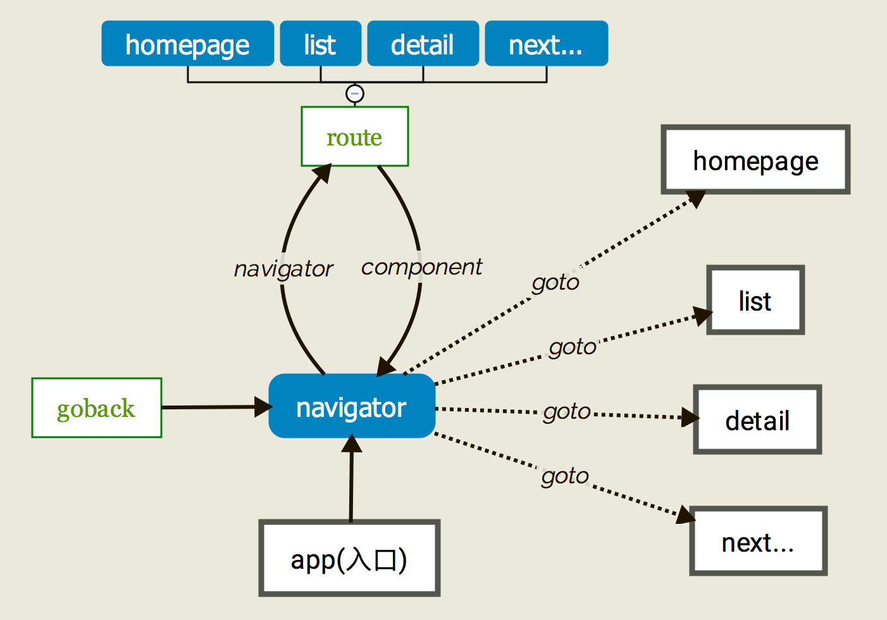

# React-Native 统一 navigator 路由入口

背景：RN 试用了一段时间了，其中 navigator 做为一个核心组件控制着整个 rnApp 的页面切换。之前写 demo 和网上见到的一些例子，navigatorr 使用方式各不相同，多数还都是到切换时才会从头引用。如下：

感觉好不爽，尤其是页面稍多、跳转稍复杂一点后，相互引用，后期要是稍有改动不利于维护。

做为一个前端童鞋，用惯了各 SPA 框架强大且优雅的路由控制，真受不了这样的调用方法。

借鉴一些前端 spa route 的思想，写了一个 `navigator` 统一路由控制。下有详述。

## 设计需求

1. 所有的页面 component 都在一个地方控制，这也是基本、不妥协需求；
2. 调用简单明确；
3. component 引入设置一定的规范，但不失灵活性；
4. 可以设定默认的 component 参数。

## 设计思路

思路也很简单，如下图：

下面简单介绍一下核心两个文件

### app.js

app.js 为单纯的 naivgator 入口，在此定制 `navigator` 组件。

~~~javascript

    _renderRoute (route, navigator) {
        // this.route = route;
        this.navigator = navigator;
        return Route.getRoutePage(route, navigator);
    }

    <Navigator
        // 初始页面
        initialRoute={{
            id: 'homepage',
            params: {}
        }}
        // 路由入口
        renderScene={this._renderRoute.bind(this)}
        configureScene={(route, routeStack) =>
            SceneConfigs.PushFromRight
        }
        sceneStyle={{flex: 1, top: 40}}
        navigationBar={
            <Navigator.NavigationBar
                routeMapper={NavigationBarMap}
                style={{backgroundColor: 'gray', marginTop: 0, height: 40, top: 0}}
            />
        }
    />

~~~

利用 `initialRoute`、`renderScene` 方法分区确定初始页面和路由跳转相应的页面。

> 补充知识：每当 naivgator push 时，都会调用 `renderScene` 方法。并传入相应参数。

### route.js

通过跳转时 push 传入的参数，给 navigator 返回相应的 `component`。

~~~javascript

'use strict';
import React from 'react';

/**
 * 所有 component 整个框架内只有此处引入
 * navigator 统一进行路由显示
 * 将全部 component 的引用从老式的层级式改为统一入口的扁平式
 */ 
import Homepage from '../components/homepage';
import List from '../components/list';
import Detail from '../components/detail';
import Error from '../components/error';

/*
 * 路由配置项
 * 可配置默认参数 props: params ，配合 this.props 的限制可使代码更严谨
 * component 默认和 key 、component 文件夹名称一致，首字母大写，component 文件夹内强制 index.js 为入口文件
 */
const RouteMap = {
    'homepage': {index: 0, component: Homepage, params: {}},
    'list': {index: 1, component: List, params: {}},
    'detail': {index: 2, component: Detail, params: {}}
};

class Route {

    /**
     * 获取 ID 对应的 Component
     * @param {any} id 页面的 ID 
     *              有严格的映射关系，会根据传入 ID 同名的文件夹去取路由对应的页面
     * @param {any} params Component 用到的参数
     */
    static getRoutePage (route, navigator) {
        let id = route.id,
            params = route.params,
            routeObj = RouteMap[id],
            Component;
        if (routeObj) {
            Component = routeObj.component;
            //合并默认参数
            Object.assign(params, routeObj.params);
        } else {
            Component = Error;
            params = {message: '当前页面没有找到：' + id};
        }
        return <Component navigator={navigator} {...params} />;
    }     
    
}

export default Route;

~~~

在此处，规定 component 按文件夹做为模块划分，(index.js自然成为入口)，`RouteMap`确定好路由的关键字 `id`、组件指向、默认参数。

规定 push 传来的 `id` 做为关键字，取到相应的 `component`，然后返回给 `Navigator` 的 `renderScene` 方法进行跳转。

这样，每个 `component` 之间不会再有引用关系，不管页面间的跳转有多复杂，只需 `navigator.push({id: XXX})` 就会跳转到指定的页面。 

## 尾记

到此，总体的路由跳转就结束了。

现在市面好也慢慢出现了一些 RN 的框架，各种问题、坑点也都在不段的完善，以后有新内容再继续补充完善。